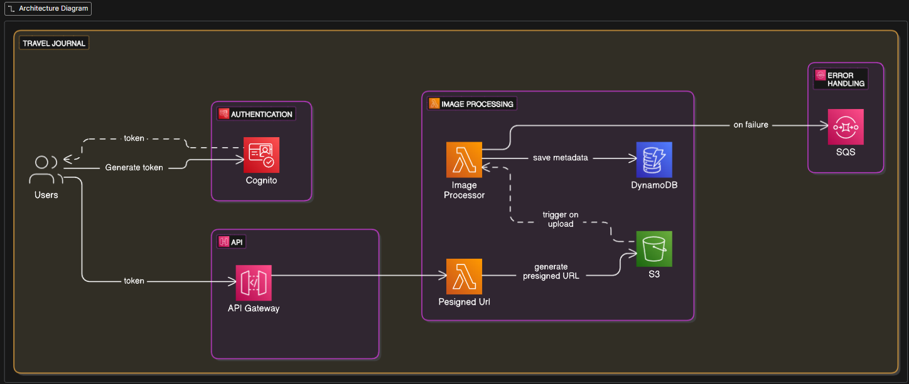

# Travel Journal - Serverless Image Backup Service

A scalable, serverless image upload and backup system built on AWS that allows users to securely store and manage their photos with automatic processing and metadata extraction.

## 🏗️ Architecture Overview

The system is built using AWS serverless technologies with the following components:

- **Frontend**: React application deployed via CloudFront
- **Authentication**: AWS Cognito for user management
- **API Layer**: Node.js Lambda functions with API Gateway
- **Storage**: S3 bucket for image storage with pre-signed URLs
- **Processing**: Golang Lambda for image metadata extraction
- **Database**: DynamoDB for metadata storage
- **Error Handling**: SQS dead letter queue for failed operations
- **Infrastructure**: Serverless Framework v4 with compose functionality

## ✨ Key Features

- **Bypass API Gateway Limitations**: Upload images larger than 10MB using S3 pre-signed URLs
- **Secure Authentication**: JWT-based authentication with AWS Cognito
- **Automatic Image Processing**: Extract and store metadata using Golang Lambda
- **Error Recovery**: Dead letter queue handling for failed operations
- **Content Delivery**: CloudFront distribution for fast image serving
- **Scalable Architecture**: Pay-per-use serverless infrastructure
- **Infrastructure as Code**: Complete deployment automation with Serverless Framework

## 🛠️ Services Overview

### API Service (Node.js)

- **Route**: `/get-upload-url` - Generate pre-signed URLs for S3 uploads
- **Route**: `/user/files` - List user's uploaded images
- **Authentication**: Cognito JWT authorizer
- **Runtime**: Node.js 18.x

### Image Processor Service (Golang)

- **Trigger**: S3 object creation events
- **Function**: Extract image metadata
- **Storage**: Save metadata to DynamoDB
- **Error Handling**: Failed operations sent to SQS dead letter queue
- **Runtime**: Go 1.x

### Authentication Service

- **Provider**: AWS Cognito User Pool
- **Features**: User registration, login, JWT token management
- **Free Tier**: 50,000 monthly active users

## 📊 Cost Optimization

This project is designed with cost efficiency in mind:

- **Lambda**: Pay only for execution time
- **S3**: Standard storage pricing with intelligent tiering
- **DynamoDB**: On-demand billing for variable workloads
- **Cognito**: 50,000 free monthly active users
- **API Gateway**: Pay per API call
- **CloudFront**: Free tier includes 1TB data transfer

### Error Handling

- Failed image processing operations are sent to SQS dead letter queue
- Check queue for unprocessed items: `travel-journal-dlq`

## ⚡ Tech Stack

- **Frontend**: React, TypeScript, Tailwind CSS
- **Backend**: Node.js, AWS Lambda
- **Processing**: Golang
- **Database**: DynamoDB
- **Storage**: S3
- **Authentication**: AWS Cognito
- **Infrastructure**: Serverless Framework v4
- **Monitoring**: CloudWatch
- **Message Queue**: SQS
